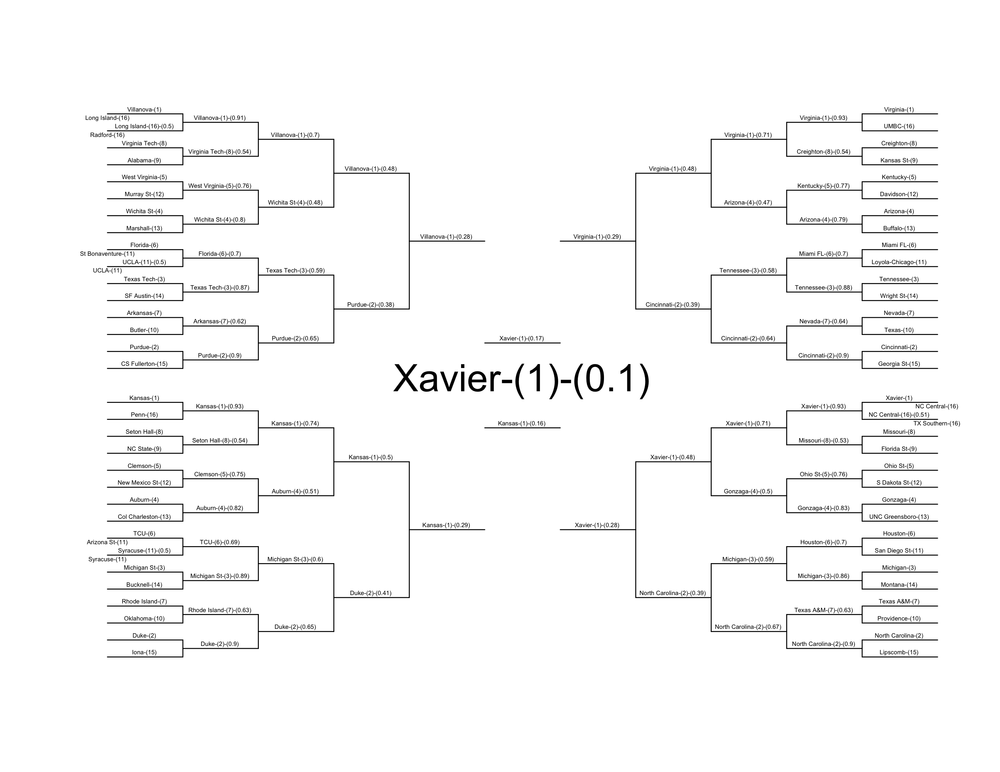
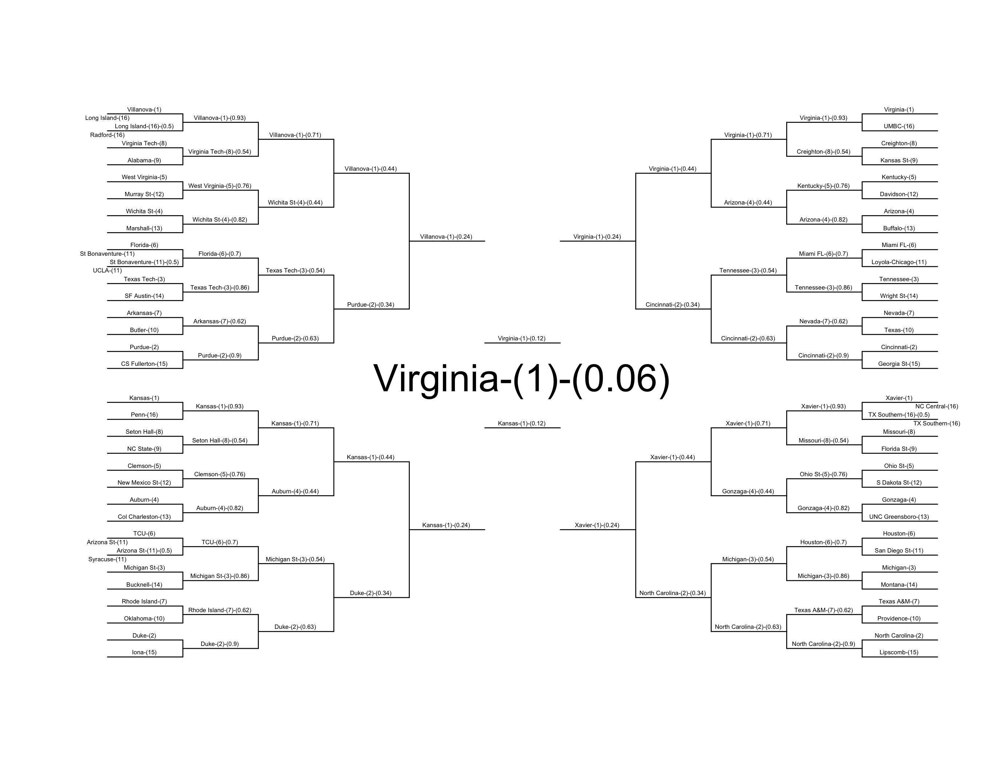

<!-- README.md is generated from README.Rmd. Please edit that file -->
[](https://travis-ci.org/zachmayer/kaggleNCAA) [](https://coveralls.io/r/zachmayer/kaggleNCAA?branch=master)

Kaggle NCAA Bracket Simulator
=============================

Simulate the NCAA tournament based on a kaggle-format bracket (with predictions for every possible matchup).

First, re-install the package:
------------------------------

``` r
devtools::install_github('zachmayer/kaggleNCAA')
```

Now load the tournment from a csv
---------------------------------

This `seed_benchmark_men.csv` is a simple seed-based benchmark I made. Turn it into a bracket with 4 functions:
\* `parseBracket` to load the data from a .csv
\* `simTourney` to simulate the tourney (you can also use `walkTourney`). Use at least 1000 simulations (more is better). One day I will parallelize this =D
\* `extractBracket` to extract a bracket from the simulation results
\* `printableBracket` to actually print the bracket

(Load my data with `{r} data(sample_submission_men, package='kaggleNCAA')` if you want to just use the seeds)

``` r
set.seed(1)
library('kaggleNCAA')
dat <- parseBracket('seed_benchmark_men.csv')
#> Assuming men's bracket
sim <- simTourney(dat, 1000, progress=TRUE)
#> assuming women = 0
bracket <- extractBracket(sim)
printableBracket(bracket)
#> assuming women = 0
```

 If simulation's not your thing (e.g. your predicted probabilities are transitive), you can also "walk" forward through the tournament, which is much faster:

``` r
bracket <- walkTourney(dat)
printableBracket(bracket)
#> assuming women = 0
```

 Note in this case that the probabilities associated with the team making it to a given round will be incorrect
